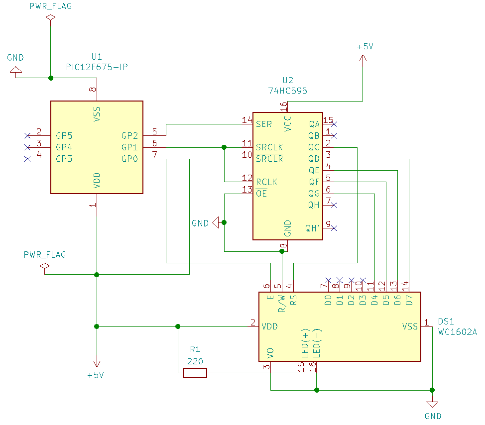

HD44780 Library for the PIC12F675
=================================

This example provides a simple library for writing to a 1602-LCD screen
based on the HD44780-chip.

Even in 4-bit mode, the HD44780 needs 5 connections, too much for the
PIC. So we use a SIPO (serial in, parallel out) shift-register
inbetween (a 75HC595), so we save two pins on the PIC-side:

We also don't bother to clock out from serial-register to parallel-register.
Instead we connect SRCLK and RCLK, which is fine since we only use 5 bits
of the register anyway.

Note that this is not a feature-complete implementation. If you need
additional functionality, just take a look at the HD44780-datasheet and
implement the necessary commands (which boils down to sending the relevent
hex-codes down the line).
