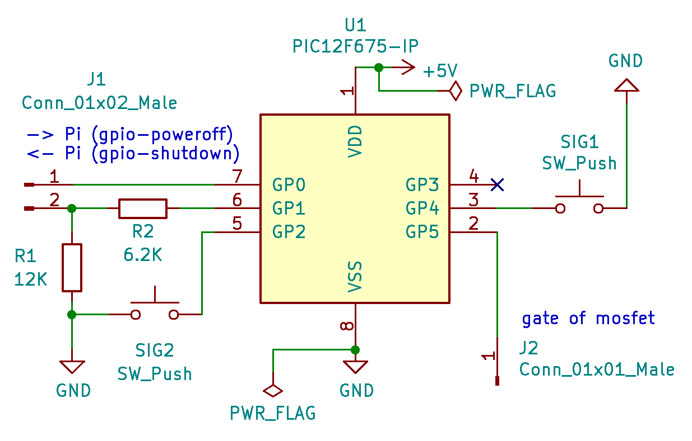

About
=====

This is a simple "firmware" for the following setup:

  - The power of a Raspberry Pi is controlled by a PIC using a mosfet.
  - On a signal (high->low), the PIC sets the gate of the mosfet
    to high, thus turning on the Pi. Afterward the PIC waits for
    five seconds. This gives the Pi time to setup it's GPIOs correctly.
  - Again on a signal (high->low), the PIC requests the Pi to shutdown by
    setting an output pin to low. This pin is connected and monitored
    by the Pi (using `dtoverlay=gpio-shutdown,gpio_pin=x,gpio_pull=off` in
    `/boot/config.txt` - don't use the default pin 3, since it has a
    pullup).
  - The Pi now shuts down and at the end sets a pin to high (using the
    overlay `dtoverlay=gpio-poweroff,gpiopin=y` in `/boot/config.txt`).
    Note that the Pi temporarely pulls up the pin during early boot.
  - This pin is connected to the PIC and the PIC now sets the gate to low
    thus turning power off.

The simplest "external signal" is a button connected to the PIC and to GND,
but it could also be a RTC-clock (alarm-pin), or e.g. a motion-sensor. 

Note that the program `rpi_mosfet_on_off.c` supports two external signals.
The default pin-configuration can be changed within the program:

  - GP0: PIN_FROM_PI (low->high, connected to the Pi
    (same pin as in the gpio-poweroff overlay)
  - GP1: PIN_TO_PI (high->low, shutdown-request, monitored by the Pi)
  - GP2: PIN_SIG2 (high->low, second signal)
  - GP3: not connected (reset)
  - GP4: PIN_SIG1 (high->low, first signal)
  - GP5: PIN_POWER (connected to the gate of the mosfet)

In this scenario, the PIC should run at 5V to provide enough voltage to
the gate of the mosfet. So PIN_TO_PI needs a voltage divider when
connected to the Pi:

